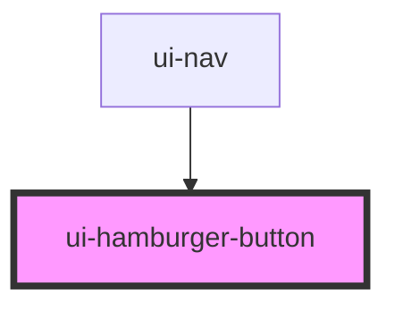

# ui-hamburger-button

<!-- Auto Generated Below -->

## Properties

| Property | Attribute | Description | Type     | Default     |
| -------- | --------- | ----------- | -------- | ----------- |
| `first`  | `first`   |             | `string` | `undefined` |

## Events

| Event         | Description | Type                   |
| ------------- | ----------- | ---------------------- |
| `clickActive` |             | `CustomEvent<boolean>` |

## Dependencies

### Used by

 - [ui-nav](../../molecules/ui-nav)

### Graph

----------------------------------------------

*Built with [StencilJS](https://stenciljs.com/)*
