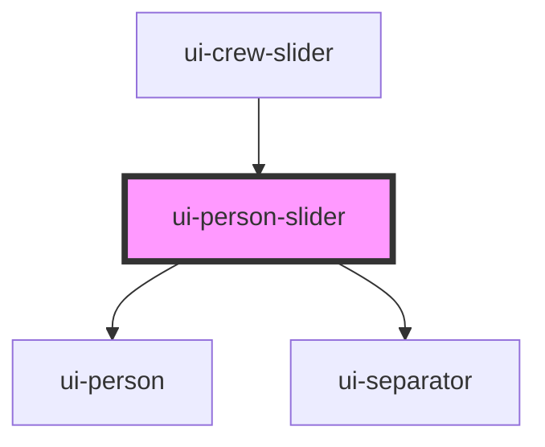

# ui-person-slider

<!-- Auto Generated Below -->

## Properties

| Property        | Attribute | Description | Type       | Default     |
| --------------- | --------- | ----------- | ---------- | ----------- |
| `crewKeys`      | --        |             | `string[]` | `[]`        |
| `currentPerson` | --        |             | `Person`   | `undefined` |

## Events

| Event          | Description | Type                  |
| -------------- | ----------- | --------------------- |
| `changePerson` |             | `CustomEvent<string>` |

## Dependencies

### Used by

 - [ui-crew-slider](../../molecules/ui-crew-slider)

### Depends on

- [ui-person](../ui-person)
- [ui-separator](../ui-separator)

### Graph

----------------------------------------------

*Built with [StencilJS](https://stenciljs.com/)*
