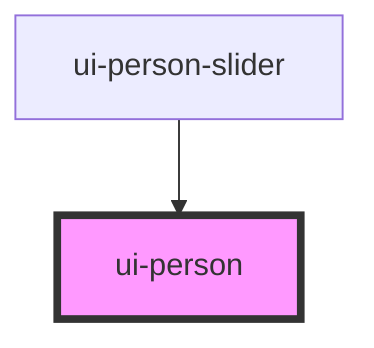

# ui-person

<!-- Auto Generated Below -->

## Properties

| Property    | Attribute    | Description | Type     | Default     |
| ----------- | ------------ | ----------- | -------- | ----------- |
| `personImg` | `person-img` |             | `string` | `undefined` |

## Dependencies

### Used by

 - [ui-person-slider](../ui-person-slider)

### Graph

----------------------------------------------

*Built with [StencilJS](https://stenciljs.com/)*
