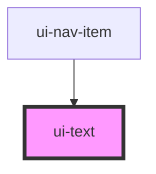

# ui-text

<!-- Auto Generated Below -->

## Properties

| Property | Attribute | Description | Type                                                   | Default    |
| -------- | --------- | ----------- | ------------------------------------------------------ | ---------- |
| `color`  | `color`   |             | `"dark" \| "purple" \| "white"`                        | `'dark'`   |
| `size`   | `size`    |             | `"h1" \| "h2" \| "h3" \| "h4" \| "h6" \| "nav" \| "p"` | `'p'`      |
| `type`   | `type`    |             | `"block" \| "inline"`                                  | `'inline'` |
| `weight` | `weight`  |             | `"bold" \| "normal"`                                   | `'normal'` |

## Dependencies

### Used by

 - [ui-nav-item](../../molecules/ui-nav-item)

### Graph

----------------------------------------------

*Built with [StencilJS](https://stenciljs.com/)*
