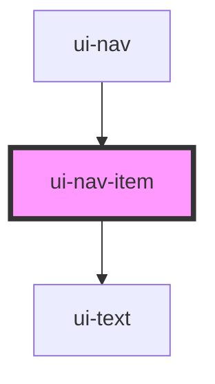

# ui-nav-item

<!-- Auto Generated Below -->

## Properties

| Property    | Attribute    | Description | Type     | Default |
| ----------- | ------------ | ----------- | -------- | ------- |
| `name`      | `name`       |             | `string` | `''`    |
| `navNumber` | `nav-number` |             | `string` | `''`    |

## Dependencies

### Used by

 - [ui-nav](../ui-nav)

### Depends on

- [ui-text](../../atoms/ui-text)

### Graph

----------------------------------------------

*Built with [StencilJS](https://stenciljs.com/)*
