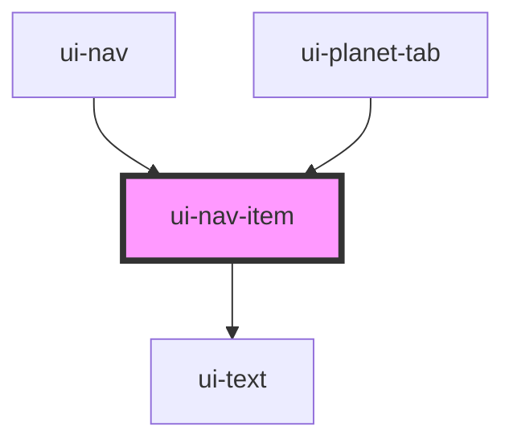

# ui-nav-item

<!-- Auto Generated Below -->

## Properties

| Property     | Attribute     | Description | Type      | Default |
| ------------ | ------------- | ----------- | --------- | ------- |
| `center`     | `center`      |             | `boolean` | `false` |
| `name`       | `name`        |             | `string`  | `''`    |
| `navActive`  | `nav-active`  |             | `boolean` | `false` |
| `navNumber`  | `nav-number`  |             | `string`  | `''`    |
| `onlyBottom` | `only-bottom` |             | `boolean` | `false` |

## Dependencies

### Used by

 - [ui-nav](../ui-nav)
 - [ui-planet-tab](../ui-planet-tab)

### Depends on

- [ui-text](../../atoms/ui-text)

### Graph

----------------------------------------------

*Built with [StencilJS](https://stenciljs.com/)*
