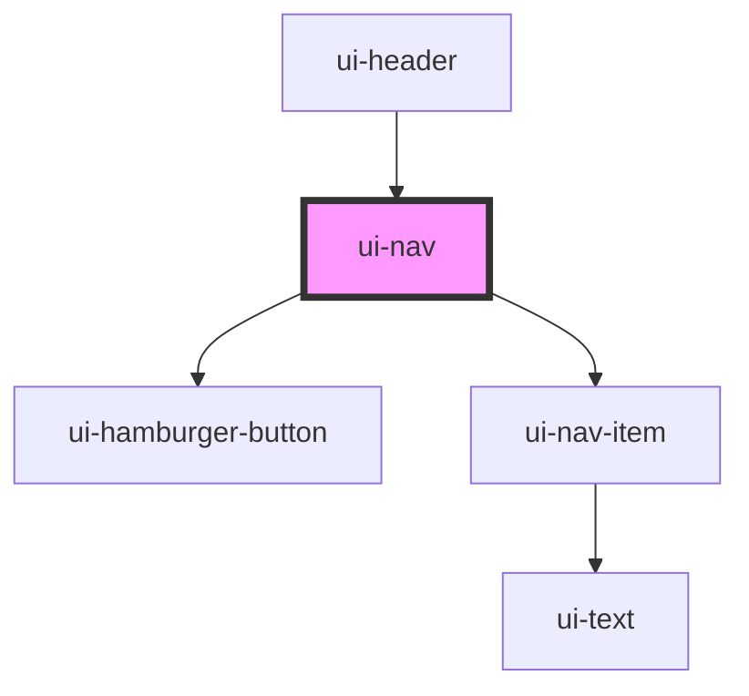

# ui-nav

<!-- Auto Generated Below -->

## Properties

| Property  | Attribute | Description | Type        | Default     |
| --------- | --------- | ----------- | ----------- | ----------- |
| `last`    | `last`    |             | `string`    | `undefined` |
| `navList` | --        |             | `NavList[]` | `NAV_LIST`  |

## Dependencies

### Used by

 - [ui-header](../ui-header)

### Depends on

- [ui-hamburger-button](../../atoms/ui-hamburger-button)
- [ui-nav-item](../ui-nav-item)

### Graph

----------------------------------------------

*Built with [StencilJS](https://stenciljs.com/)*
