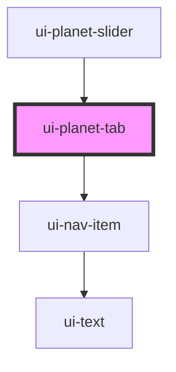

# ui-planet-tab

<!-- Auto Generated Below -->

## Properties

| Property     | Attribute     | Description | Type       | Default     |
| ------------ | ------------- | ----------- | ---------- | ----------- |
| `currentKey` | `current-key` |             | `string`   | `undefined` |
| `planetKeys` | --            |             | `string[]` | `[]`        |

## Events

| Event      | Description | Type                  |
| ---------- | ----------- | --------------------- |
| `clickTab` |             | `CustomEvent<string>` |

## Dependencies

### Used by

 - [ui-planet-slider](../ui-planet-slider)

### Depends on

- [ui-nav-item](../ui-nav-item)

### Graph

----------------------------------------------

*Built with [StencilJS](https://stenciljs.com/)*
